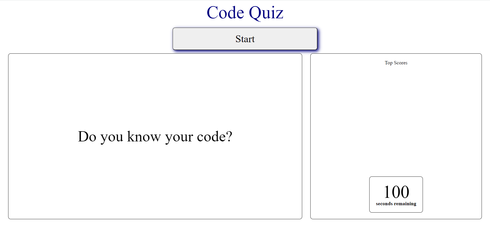
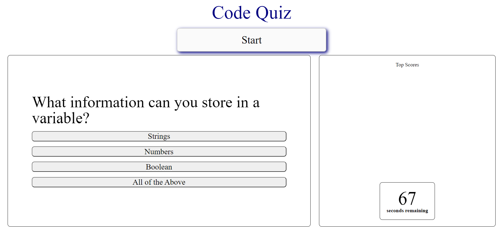
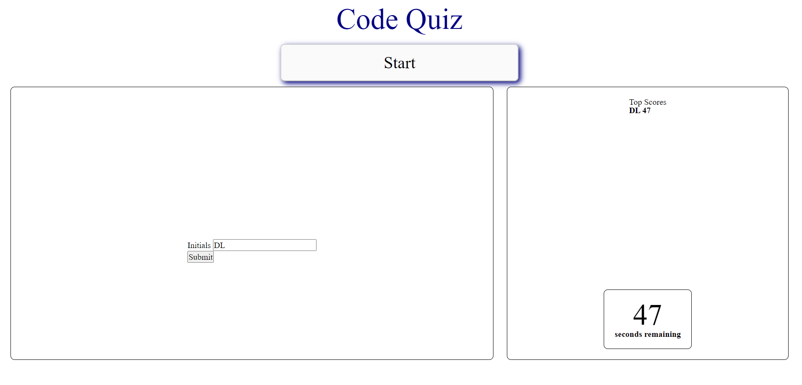

# Timed-Code-Quiz

## Description

A timed quiz that prompts questions regarding coding knowledge for the user and provides multiple choice options for the user to select. Incorrect selections will penalize user by decreasing timer by 10 seconds. Scores are determined by the remaining time alloted in the timer. At the end of the quiz, users can input their initials and their scores will display on the screen.

## [Try it yourself!](https://maestroluu.github.io/JavaScript-Random-Password-Generator/)

The following images show a glimpse of the application:

## Getting Started

This is a simple application that runs right in the browser, no installation or downloads needed.

## Built With:

HTML  
JavaScript 
CSS

## Author:

David Luu

## Planned Updates

Further updates have been planned to focus on debugging known errors within the application.